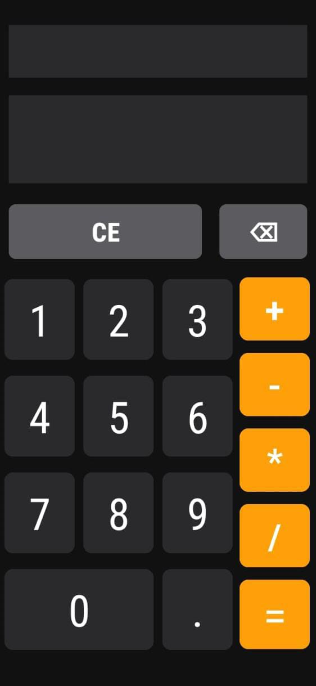
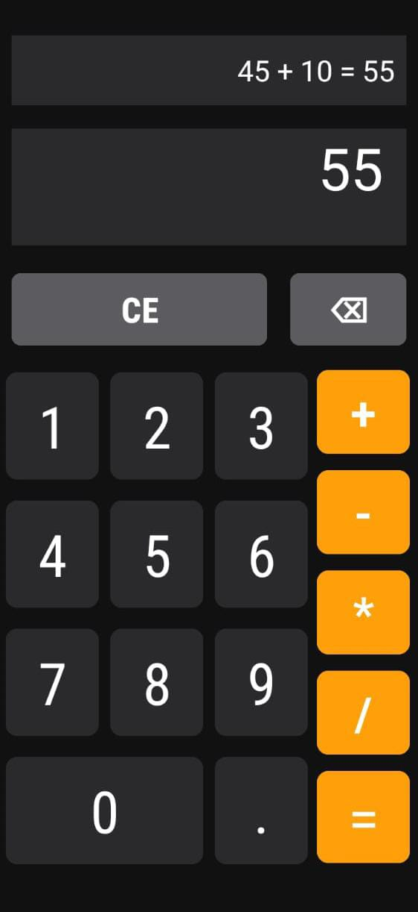

# 📱 Standard Calculator App

A simple and fully functional **Calculator Android Application** built using **Kotlin** in Android Studio.  
This app performs all basic arithmetic operations with a clean and user-friendly interface.  

---

## ✨ Features
- ➕ Addition, ➖ Subtraction, ✖ Multiplication, ➗ Division  
- 🧮 Supports decimal calculations  
- 🧹 Clear (CE) button to reset  
- ⬅ Backspace (⌫) to remove last input  
- 🎨 Simple and responsive UI with custom colors  
- 📱 Works smoothly on both emulator and physical device  

---

## 📸 Screenshots
| Home Screen | Result |
|-------------| --------|
|  |  |

---

## 🛠️ Tech Stack
- **Language:** Kotlin  
- **IDE:** Android Studio  
- **UI Layouts:** LinearLayout, GridLayout  
- **Components:** TextView, Button  

---

## 📂 Project Structure
<pre>
  app/
├── java/
│ └── com.example.calculator/
│ └── MainActivity.kt # Core calculator logic
├── res/
│ ├── layout/
│ │ └── activity_main.xml # UI Layout
│ ├── values/
│ │ ├── colors.xml # Colors
│ │ └── themes.xml # Themes
└── AndroidManifest.xml
</pre>

---

## 🎯 Future Enhancements
- Add **scientific calculator functions** (%, √, sin, cos, etc.)  
- Implement **calculation history**  
- Improve UI with **Material Design components**  

---

### 💡 Author
Developed by **Gulam Mohyudin** 👨‍💻  
Feel free to connect with me on [LinkedIn](https://www.linkedin.com/in/gulammohyudin-memon/) or star ⭐ this repo if you liked it!  
